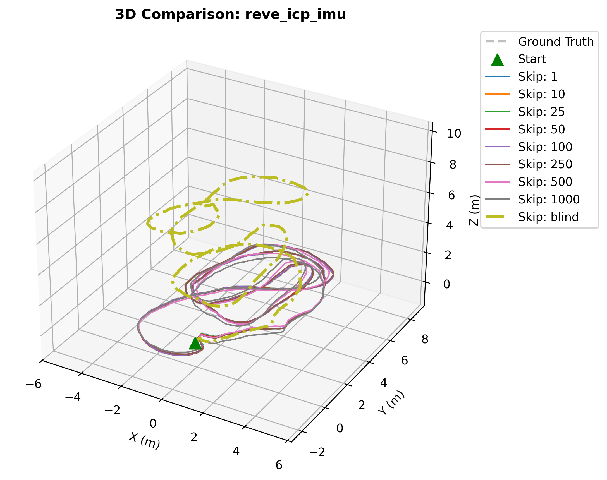
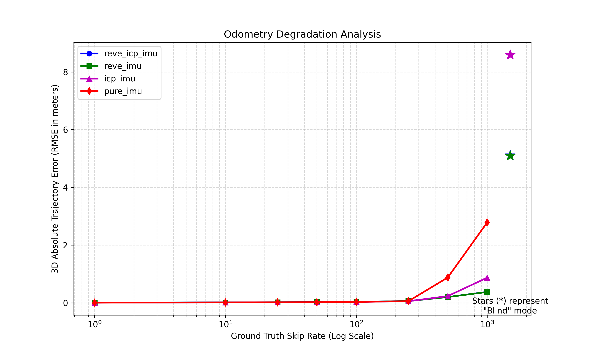
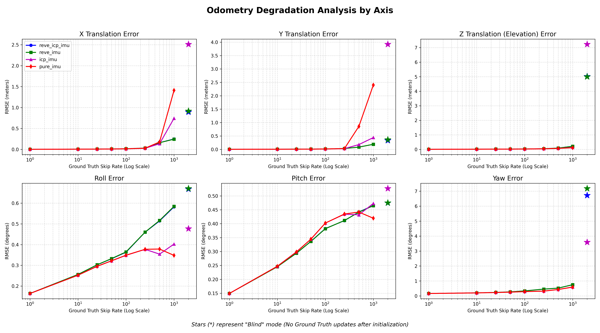
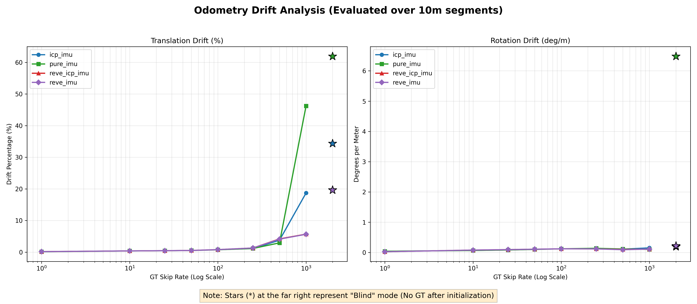

# Factor Graph Radar-Inertial Odometry (FG-RIO)

A robust, multi-sensor fusion pipeline for 4D Radar and IMU odometry using Factor Graph Optimization. This project estimates 6-DoF vehicle states by fusing Doppler-derived ego-velocity, radar intensity weighted scan matching (ICP), and IMU preintegration.



## 🚀 Key Features
- **REVE (Radar Ego-Velocity Estimator):** Direct body-frame velocity estimation using Radar Doppler measurements and RANSAC-based least squares.
- **Radar ICP:** 3D geometric registration with intensity-weighted SVD, specifically tuned for sparse radar point clouds.
- **Factor Graph Backend:** Built on **GTSAM**, utilizing ISAM2 for efficient incremental optimization of $SE(3)$ states.
- **Comprehensive Evaluation:** Automated scripts for Ablation studies, Absolute Trajectory Error (ATE), and Relative Pose Error (RPE/Drift %).

---

## Architecture

graph TD
    %% Styling definitions
    classDef sensor fill:#e3f2fd,stroke:#1f77b4,stroke-width:2px,color:#000
    classDef frontend fill:#e8f5e9,stroke:#2ca02c,stroke-width:2px,color:#000
    classDef factor fill:#fff3e0,stroke:#f57c00,stroke-width:2px,shape:rect,color:#000
    classDef state fill:#f3e5f5,stroke:#d81b60,stroke-width:2px,shape:circle,color:#000

    subgraph SENSORS [1. Sensor Data Streams]
        IMU[IMU Stream <br> High Freq: ~100-400 Hz]:::sensor
        RADAR[Radar Pointclouds <br> Low Freq: ~10-20 Hz]:::sensor
        GPS[Ground Truth / GPS <br> Absolute Poses]:::sensor
    end

    subgraph FRONTEND [2. Frontend Signal Processing]
        PREINT[IMU Preintegrator <br> Integrates IMU over dt = 1/keyframe_rate]:::frontend
        REVE[REVE Estimator <br> RANSAC Doppler Velocity]:::frontend
        FILTER[Dynamic Point Filter <br> Removes moving targets using REVE]:::frontend
        ICP[Radar ICP <br> Weighted SVD Registration]:::frontend
        SKIP[GT Subsampler <br> Evaluates gt_skip_rate]:::frontend
    end

    subgraph BACKEND [3. GTSAM Factor Graph Backend & ISAM2 Optimizer]
        direction LR
        
        %% State Nodes
        NodePrev(( Node i-1 <br><br> Pose X<br>Velocity V<br>Bias B )):::state
        NodeCurr(( Node i <br><br> Pose X<br>Velocity V<br>Bias B )):::state

        %% Factors
        Fac_IMU[ImuFactor & <br> Bias RW Factor]:::factor
        Fac_ICP[BetweenFactor <br> Pose3]:::factor
        Fac_REVE[RadarVelocityFactor <br> Custom Unary]:::factor
        Fac_GT[PriorFactor <br> Pose3]:::factor

        %% Graph Connections
        NodePrev ===>|State at t-1| Fac_IMU ===>|Predicts| NodeCurr
        NodePrev --->|Static Cloud t-1| Fac_ICP --->|Delta Pose| NodeCurr
        
        Fac_REVE --->|Body Velocity| NodeCurr
        Fac_GT -.->|Anchor / Correction| NodeCurr
    end

    %% Data Flow Connections
    IMU --> PREINT
    RADAR --> REVE
    RADAR --> FILTER
    REVE -->|Ego-Velocity| FILTER
    FILTER -->|Static Cloud t| ICP
    FILTER -.->|Static Cloud t-1| ICP
    GPS --> SKIP

    PREINT ==>|Preintegrated NavState| Fac_IMU
    ICP --->|Transform Matrix| Fac_ICP
    REVE --->|Linear Velocity| Fac_REVE
    SKIP -.->|If frame % skip_rate == 0| Fac_GT


---

## 📊 Evaluation & Results

### 1. Ablation Study & Robustness Analysis

#### The Goal: Simulating GPS/Absolute Measurement Loss
The primary challenge of any odometry system is surviving "blind spots" where absolute positioning (GPS or LiDAR/Camera Global Localization) is unavailable. We simulate these outages by varying the **Ground Truth (GT) Skip Rate**:
*   **Low Skip Rates (1-50):** Represent environments with high-frequency absolute updates (e.g., clear sky GPS).
*   **Medium Skip Rates (100-250):** Represent short signal outages (e.g., driving under a bridge or between urban buildings).
*   **High Skip Rates (1000+ / Blind):** Represent long-term GPS-denied navigation (e.g., tunnels or deep forest trails).

By turning factors off selectively, we evaluate which components (REVE velocity vs. ICP geometry) prevent the system from drifting during these outages.

#### Results: Absolute Trajectory Error (ATE) across Skip Rates
The table below shows the **Total 3D RMSE (meters)** for each configuration. As the skip rate increases, the drift characteristics of each sensor suite become apparent.

| Scenario | Skip 10 (Short) | Skip 100 (Med) | Skip 1000 (Long) | Blind (No GT) |
| :--- | :--- | :--- | :--- | :--- |
| **REVE + ICP + IMU** | **0.016 m** | **0.035 m** | **0.379 m** | **5.11 m** |
| REVE + IMU | 0.016 m | 0.035 m | 0.375 m | 5.09 m |
| ICP + IMU | 0.015 m | 0.032 m | 0.873 m | 8.59 m |
| Pure IMU | 0.015 m | 0.032 m | 2.786 m | FAILED |

#### Key Takeaways
1.  **Doppler (REVE) is the Anchor:** In "Blind" mode, configurations using **REVE** reduced the total error by **40%** compared to ICP-only (5.1m vs 8.6m). Direct Doppler velocity prevents the quadratic drift inherent in pure inertial systems.
2.  **ICP Refines Heading:** While REVE dominates translation, ICP provides critical heading (Yaw) constraints. In "Blind" mode, ICP reduced Yaw drift from **7.17°** to **6.72°**.
3.  **The "Breaking Point" for Pure IMU:** Without radar factors, the **Pure IMU** error grows exponentially. Between Skip 500 and Skip 1000, its error jumps from 0.87m to 2.78m, eventually causing mathematical failure in Blind mode.
4.  **Z-Axis Dependency:** The system maintains horizontal (X/Y) errors under **1.0m** even in blind mode, but Z-axis drift remains high due to the low vertical resolution of automotive radar.


*Figure: Comparison of 3D Positional Error (RMSE) as the outage duration increases. REVE-based methods (Green/Blue) show significantly higher stability than geometric ICP (Purple) or Pure Inertial (Red) estimation.*

***

This structure makes the data much more readable because it follows the trend of the data rather than jumping between different metrics. It highlights the **RMSE** as the primary comparison point while using the **"Blind"** scenario as the ultimate test of the system's architecture.

### 2. Axis-Specific Analysis
By analyzing the 6-DoF errors, we observe the fundamental physical constraints of the system:
- **Horizontal Stability:** X and Y translation errors remain under **1.0m** even in blind mode.
- **The Elevation Challenge:** Z-axis drift is the largest error source (**~5.0m**), reflecting the low elevation resolution of 3D automotive radars.
- **Orientation:** Roll and Pitch are strictly constrained by gravity (**<0.7°**), while Yaw drifts up to **7.2°** without geometric ICP aiding.



### 3. Drift Analysis (KITTI/evo Metrics)
Using `evo_rpe`, we evaluated the Relative Pose Error over **10m segments** to determine the system's operational drift rate.

- **Translation Drift:** ~1.29% (Typical RIO performance)
- **Rotation Drift:** ~0.118 deg/m
- **Robustness:** The system maintains <1% drift for GPS outages lasting up to 100 frames.



---

## 💻 Installation

### Dependencies
- **C++17** | **CMake** (>= 3.10) | **Eigen3** | **GTSAM** (4.x)
- **Python 3.x** (`pandas`, `matplotlib`, `scipy`, `evo`)

### Build Instructions
```bash
mkdir build && cd build
cmake ..
make -j8
```

---

## 🏃 Usage

### 1. Run Automated Evaluation Sweep
To replicate the ablation study and generate the `ablation_summary.csv`:
```bash
cd eval_scripts
python3 automate_trajectory_evaluation.py
```
**Note:** The dataset base directory has to be setup un the config.json file.

### 2. Generate Drift Leaderboard
To calculate the KITTI-style drift percentages using `evo`:
```bash
python3 automate_evo_evaluation.py
```
**None:** Change the dataset directory within the python script.

---

## 📂 Project Structure
```text
├── 3rdparty/               # 3rd party tool (Nanoflann) required for KD-Trees in ICP
├── apps/               # Main entry point(run_gt_aided_odometry)
├── factor_graph_optimization/       # GTSAM Factor implementations and GraphOptimizer
├── radar_common/       # Data types and SystemConfig loader
├── radar_velocity_estimation/     # REVE Doppler velocity estimator
├── radar_registration/ # Radar-tuned ICP and KD-Tree
├── eval_scripts/       # Python evaluation toolset (ATE, RPE, Plots)
└── config.json         # Noise parameters and ablation toggles
```

---
Here is the final section to add to the bottom of your **README.md**. I have also included a standard "Acknowledgments" section which is common in robotics repos to give it a professional finish.

***

## 📜 Acknowledgments & Citations

### 3rd Party Libraries
This project utilizes the following open-source libraries:
*   **GTSAM:** For factor graph optimization and IMU preintegration. [GitHub](https://github.com/borglab/gtsam)
*   **Eigen3:** For high-performance linear algebra. [Official Site](https://eigen.tuxfamily.org/)
*   **nlohmann_json:** For modern JSON parsing in C++. [GitHub](https://github.com/nlohmann/json)
*   **evo:** For Python-based trajectory evaluation. [GitHub](https://github.com/MichaelGrupp/evo)
*   **Nanoflann:** For efficient Nearest Neighbor searches required by the Radar ICP module. [GitHub](https://github.com/jlblancoc/nanoflann)

### Research papers
#### REVE
~~~[bibtex]
@INPROCEEDINGS{DoerMFI2020, 
  author={Doer, Christopher and Trommer, Gert F.},
  booktitle={2020 IEEE International Conference on Multisensor Fusion and Integration for Intelligent Systems (MFI)}, 
  title={An EKF Based Approach to Radar Inertial Odometry}, 
  year={2020},
  pages={152-159},
  doi={10.1109/MFI49285.2020.9235254}}
~~~